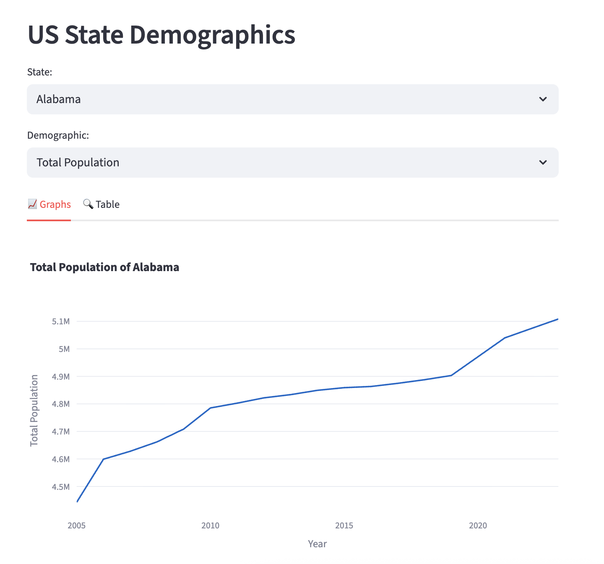

Subject: Day 0: Why Build Data Apps With Streamlit?

Welcome to *Learn to Build Data Apps in Python With Streamlit*!

In this course, you’ll build and deploy a Streamlit app that lets users explore US State demographics. They’ll select a state and a demographic variable, and the app will render a chart. A second tab will display the underlying data in table form.

Here’s a sneak peek of the final app you’ll build:

The skills you learn in this course will be useful for any app you want to build in the future!

## What to Expect

Each day for the next week, you will get an email like this with a tutorial and exercises. 

Try to complete each exercise—this is where the real learning happens. And if you get stuck, just hit “reply” and I’ll help you troubleshoot.

## Today’s Exercise: Share Your Goals

Reply to this email and let me know:
- Why did you sign up for this course?
- What kind of data apps do you want to build?

Your answers will help me tailor future lessons and examples.

  Ari Lamstein

PS If you'd like to know why I like Streamlit, you can read [this](https://github.com/arilamstein/streamlit_tutorial/blob/main/motivating_example.ipynb) Jupyter Notebook I go through when I deliver this course as an in-person workshop.

PPS If you'd like to skip ahead, you can read tomorrow's email [here]().
